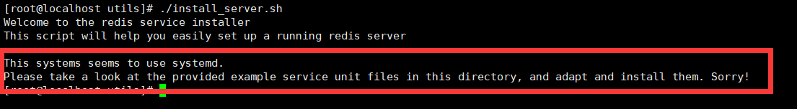

# 一、Redis服务安装部署

## 1.下载Redis服务安装包

```sh
# 切换到安装目录
cd /usr/local/src
# 下载Redis安装包
wget http://download.redis.io/releases/redis-6.0.6.tar.gz
# 解压安装包
tar zxf redis-6.0.6.tar.gz
# 进入解压目录，读 README.md 了解安装步骤
cd redis-6.0.6
```

## 2.安装Gcc编译环境

```sh
# 查看gcc版本是否在5.3以上，centos7.6默认安装4.8.5
gcc -v
#  升级gcc到5.3及以上,如下：升级到gcc 9.3
yum -y install centos-release-scl 
yum -y install devtoolset-9-gcc devtoolset-9-gcc-c++ devtoolset-9-binutils 
scl enable devtoolset-9 bash 
# 需要注意的是scl命令启用只是临时的，退出shell或重启就会恢复原系统gcc版本。 
# 如果要长期使用gcc 9.3的话：
echo "source /opt/rh/devtoolset-9/enable" >>/etc/profile 
```

## 3.编译Redis

```sh
# 编译
make
# 如果报错清除编译文件，升级gcc环境再次编译
make distclean
# 切换到编译好的源码目录下
cd /usr/local/src/redis-6.0.6/src
# 安装Redis
make install PREFIX=/usr/local/redis/redis-6.0.6
```

## 4.安装启动Redis

```sh
# 配置Redis环境变量
vim /etc/profile
# 在文件末尾加入
export REDIS_HOME=/usr/local/redis/redis-6.0.6
export PATH=${REDIS_HOME}/bin:${PATH}
# 保存后刷新
source /etc/profile
```

使用 install_server.sh 安装redis配置并启动redis

```sh
. /usr/local/src/redis-6.0.6/utils/install_server.sh
```

如果报错：



```sh
# 修改install_server.sh
vim /usr/local/src/redis-6.0.6/utils/install_server.sh
```

注释以下内容


再次执行install_server.sh脚本

# 二、配置文件修改

## 1.conf文件修改

修改配置文件以下内容

    注释绑定IP 如 bind # bind 127.0.0.1 ::1  
    protected-mode no
    #启动端口
    port 63xx 
    #允许远程访问
    daemonize yes
    #pid 
    pidfile /var/run/redis_63xx.pid 
    #日志输出
    logfile /var/log/redis/redis-server.log 
    #数据库存放路径
    dir /var/lib/redis
    #密码
    requirepass yourpassword

## 2.服务脚本

如果增加了密码验证，还需要修改服务脚本


    -a 参数，后面跟你的认证密码